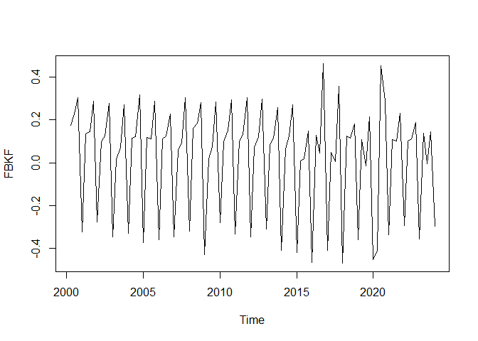

Modulo VII
================
Hugo Donoso Reinoso
2024-09-11

``` r
data <- read_xlsx("E:\\Betametrica\\MODULO VII\\base.xlsx")
View(data)
```

CONVERTIR UNA SERIE TEMPORAL

``` r
fbkf <- ts(data[,2], start = c(2000, 1), end = c(2024, 1), freq = 4)
fbkf
```

    ##           Qtr1      Qtr2      Qtr3      Qtr4
    ## 2000  460357.1  547687.2  688960.3  934506.3
    ## 2001  676350.1  774179.0  894208.2 1193012.3
    ## 2002  903531.7  997494.6 1130164.5 1492001.3
    ## 2003 1054456.3 1070374.8 1148798.5 1506334.6
    ## 2004 1083090.7 1214865.4 1370922.8 1881349.7
    ## 2005 1296203.1 1460904.3 1632106.3 2174334.6
    ## 2006 1518777.5 1700310.9 1929025.8 2426195.6
    ## 2007 1713755.8 1814816.7 1986960.2 2692715.2
    ## 2008 1951695.1 2292875.4 2759941.1 3655968.5
    ## 2009 2378786.1 2426424.9 2616111.0 3480599.4
    ## 2010 2628103.6 2899481.5 3373487.2 4533443.0
    ## 2011 3249309.7 3598423.8 4111917.6 5580956.4
    ## 2012 3948042.3 4237629.4 4788153.1 6450357.2
    ## 2013 4730115.4 5139785.9 5767879.3 7467006.2
    ## 2014 4949126.9 5291738.6 6006448.2 7874819.8
    ## 2015 5175400.7 5227135.7 5329460.1 6180500.7
    ## 2016 3876351.8 4410826.2 4614660.2 7330637.4
    ## 2017 4859820.8 5099611.8 5124900.3 7335673.0
    ## 2018 4579067.4 5189001.2 5818905.5 6971163.9
    ## 2019 4859900.4 5410816.1 5332434.9 6620689.7
    ## 2020 4209318.6 2790232.7 4395090.3 5856774.4
    ## 2021 4177626.8 4660185.6 5152542.4 6502808.2
    ## 2022 4849144.9 5364488.4 6002244.8 7251033.9
    ## 2023 5068963.1 5813167.0 5786415.0 6687916.9
    ## 2024 4960540.4

CONVERSIÓN DE SERIES DE TIEMPO EN LOGARITMOS - TASAS DE CRECIMIENTO

Generar los logaritmos de las series

``` r
lfbkf <- log(fbkf)
lfbkf
```

    ##          Qtr1     Qtr2     Qtr3     Qtr4
    ## 2000 13.03976 13.21346 13.44294 13.74777
    ## 2001 13.42447 13.55956 13.70369 13.99199
    ## 2002 13.71407 13.81300 13.93787 14.21563
    ## 2003 13.86854 13.88352 13.95423 14.22519
    ## 2004 13.89533 14.01014 14.13099 14.44750
    ## 2005 14.07495 14.19457 14.30538 14.59223
    ## 2006 14.23342 14.34632 14.47253 14.70184
    ## 2007 14.35420 14.41150 14.50212 14.80606
    ## 2008 14.48421 14.64532 14.83072 15.11187
    ## 2009 14.68210 14.70193 14.77720 15.06272
    ## 2010 14.78177 14.88004 15.03146 15.32699
    ## 2011 14.99395 15.09601 15.22940 15.53487
    ## 2012 15.18873 15.25951 15.38166 15.67965
    ## 2013 15.36946 15.45252 15.56782 15.82600
    ## 2014 15.41472 15.48166 15.60834 15.87918
    ## 2015 15.45943 15.46937 15.48876 15.63691
    ## 2016 15.17041 15.29957 15.34475 15.80757
    ## 2017 15.39651 15.44467 15.44962 15.80826
    ## 2018 15.33701 15.46205 15.57662 15.75729
    ## 2019 15.39653 15.50391 15.48932 15.70571
    ## 2020 15.25281 14.84164 15.29600 15.58311
    ## 2021 15.24525 15.35457 15.45500 15.68774
    ## 2022 15.39431 15.49531 15.60764 15.79665
    ## 2023 15.43865 15.57564 15.57102 15.71581
    ## 2024 15.41703

``` r
# Grafico de la serie original
plot(fbkf, main="Formación bruta de capital fijo", ylab="miles U$ dólares", xlab="Periodo")
```

<!-- -->

``` r
# Grafico de la serie en logaritmos
plot(lfbkf, main="Logaritmo de Formación Bruta de Capital fijo", ylab="miles U$ dólares", xlab="Periodo")
```

<!-- -->

Se aplica a la serie de la variable Formación Bruta de Capital Fijo, lo
logaritmos con el propósito de suavizar los resultados que se expresan
en la gráfica con disminuyento las variaciones a partir del año 2015. El
modelo ARIMA exige que debe haber criterios de estacionalidad, y los
logaritmos permiten este lograr este aspecto.

Generar los rezagos interanuales

``` r
lfbkflag4 = stats::lag(lfbkf, -4)
lfbkflag4
```

    ##          Qtr1     Qtr2     Qtr3     Qtr4
    ## 2001 13.03976 13.21346 13.44294 13.74777
    ## 2002 13.42447 13.55956 13.70369 13.99199
    ## 2003 13.71407 13.81300 13.93787 14.21563
    ## 2004 13.86854 13.88352 13.95423 14.22519
    ## 2005 13.89533 14.01014 14.13099 14.44750
    ## 2006 14.07495 14.19457 14.30538 14.59223
    ## 2007 14.23342 14.34632 14.47253 14.70184
    ## 2008 14.35420 14.41150 14.50212 14.80606
    ## 2009 14.48421 14.64532 14.83072 15.11187
    ## 2010 14.68210 14.70193 14.77720 15.06272
    ## 2011 14.78177 14.88004 15.03146 15.32699
    ## 2012 14.99395 15.09601 15.22940 15.53487
    ## 2013 15.18873 15.25951 15.38166 15.67965
    ## 2014 15.36946 15.45252 15.56782 15.82600
    ## 2015 15.41472 15.48166 15.60834 15.87918
    ## 2016 15.45943 15.46937 15.48876 15.63691
    ## 2017 15.17041 15.29957 15.34475 15.80757
    ## 2018 15.39651 15.44467 15.44962 15.80826
    ## 2019 15.33701 15.46205 15.57662 15.75729
    ## 2020 15.39653 15.50391 15.48932 15.70571
    ## 2021 15.25281 14.84164 15.29600 15.58311
    ## 2022 15.24525 15.35457 15.45500 15.68774
    ## 2023 15.39431 15.49531 15.60764 15.79665
    ## 2024 15.43865 15.57564 15.57102 15.71581
    ## 2025 15.41703

``` r
fbkflag4 = stats::lag(fbkf, -4)
fbkflag4
```

    ##           Qtr1      Qtr2      Qtr3      Qtr4
    ## 2001  460357.1  547687.2  688960.3  934506.3
    ## 2002  676350.1  774179.0  894208.2 1193012.3
    ## 2003  903531.7  997494.6 1130164.5 1492001.3
    ## 2004 1054456.3 1070374.8 1148798.5 1506334.6
    ## 2005 1083090.7 1214865.4 1370922.8 1881349.7
    ## 2006 1296203.1 1460904.3 1632106.3 2174334.6
    ## 2007 1518777.5 1700310.9 1929025.8 2426195.6
    ## 2008 1713755.8 1814816.7 1986960.2 2692715.2
    ## 2009 1951695.1 2292875.4 2759941.1 3655968.5
    ## 2010 2378786.1 2426424.9 2616111.0 3480599.4
    ## 2011 2628103.6 2899481.5 3373487.2 4533443.0
    ## 2012 3249309.7 3598423.8 4111917.6 5580956.4
    ## 2013 3948042.3 4237629.4 4788153.1 6450357.2
    ## 2014 4730115.4 5139785.9 5767879.3 7467006.2
    ## 2015 4949126.9 5291738.6 6006448.2 7874819.8
    ## 2016 5175400.7 5227135.7 5329460.1 6180500.7
    ## 2017 3876351.8 4410826.2 4614660.2 7330637.4
    ## 2018 4859820.8 5099611.8 5124900.3 7335673.0
    ## 2019 4579067.4 5189001.2 5818905.5 6971163.9
    ## 2020 4859900.4 5410816.1 5332434.9 6620689.7
    ## 2021 4209318.6 2790232.7 4395090.3 5856774.4
    ## 2022 4177626.8 4660185.6 5152542.4 6502808.2
    ## 2023 4849144.9 5364488.4 6002244.8 7251033.9
    ## 2024 5068963.1 5813167.0 5786415.0 6687916.9
    ## 2025 4960540.4

Generar las tasas de crecimiento interanual

``` r
tclfbkf4 <- (lfbkf - lfbkflag4) * 100
tclfbkf4
```

    ##              Qtr1         Qtr2         Qtr3         Qtr4
    ## 2001  38.47082774  34.60988880  26.07549904  24.42183087
    ## 2002  28.96004352  25.34435431  23.41798235  22.36369406
    ## 2003  15.44693670   7.05174143   1.63534408   0.95609075
    ## 2004   2.67933745  12.66244593  17.67674743  22.23101737
    ## 2005  17.96206080  18.44223325  17.43873411  14.47332484
    ## 2006  15.84664332  15.17554669  16.71436770  10.96017567
    ## 2007  12.07816184   6.51733982   2.95908426  10.42256094
    ## 2008  13.00109228  23.38221823  32.86034188  30.58109714
    ## 2009  19.78920463   5.66122846  -5.35204933  -4.91565150
    ## 2010   9.96722112  17.81129651  25.42581436  26.42771813
    ## 2011  21.21800722  21.59639996  19.79424806  20.78784604
    ## 2012  19.47772511  16.35080817  15.22552857  14.47753470
    ## 2013  18.07297543  19.30074268  18.61597073  14.63586351
    ## 2014   4.52615862   2.91354158   4.05291218   5.31761604
    ## 2015   4.47055914  -1.22833924 -11.95836526 -24.22710099
    ## 2016 -28.90223091 -16.98014415 -14.40116995  17.06631830
    ## 2017  22.61071092  14.51024146  10.48728337   0.06866855
    ## 2018  -5.95062180   1.73768090  12.70011018  -5.09669550
    ## 2019   5.95225919   4.18586883  -8.73042170  -5.15826602
    ## 2020 -14.37171586 -66.22749181 -19.33198893 -12.26005360
    ## 2021  -0.75574449  51.29302662  15.90021978  10.46351019
    ## 2022  14.90590318  14.07457484  15.26432611  10.89099593
    ## 2023   4.43339037   8.03245036  -3.66205981  -8.08416104
    ## 2024  -2.16215943

``` r
tcfbkf4 <- (fbkf / fbkflag4 - 1) * 100
tcfbkf4
```

    ##              Qtr1         Qtr2         Qtr3         Qtr4
    ## 2001  46.91856642  41.35423912  29.79096262  27.66229979
    ## 2002  33.58936054  28.84546353  26.38717456  25.06168888
    ## 2003  16.70385276   7.30632559   1.64878902   0.96067590
    ## 2004   2.71555443  13.49907025  19.33535754  24.89587120
    ## 2005  19.67632346  20.25235807  19.05166125  15.57312359
    ## 2006  17.17125929  16.38755955  18.19240684  11.58336087
    ## 2007  12.83784683   6.73440838   3.00330021  10.98508194
    ## 2008  13.88408226  26.34198139  38.90268845  35.77256333
    ## 2009  21.88308095   5.82454328  -5.21134845  -4.79678893
    ## 2010  10.48087148  19.49603024  28.95046387  30.24891720
    ## 2011  23.63705010  24.10576996  21.88922818  23.10635374
    ## 2012  21.50403074  17.76348724  16.44574678  15.57798917
    ## 2013  19.80913565  21.28918013  20.46146308  15.76112737
    ## 2014   4.63015221   2.95640043   4.13616356   5.46154102
    ## 2015   4.57199457  -1.22082595 -11.27102194 -21.51565516
    ## 2016 -25.10045042 -15.61676500 -13.41223824  18.60911861
    ## 2017  25.37099420  15.61579716  11.05693744   0.06869213
    ## 2018  -5.77703252   1.75286641  13.54182688  -4.96899270
    ## 2019   6.13297382   4.27471160  -8.36017307  -5.02748577
    ## 2020 -13.38673084 -48.43231236 -17.57817266 -11.53830354
    ## 2021  -0.75289592  67.01780979  17.23405232  11.03053881
    ## 2022  16.07415078  15.11319336  16.49093363  11.50619449
    ## 2023   4.53313367   8.36386553  -3.59581747  -7.76602311
    ## 2024  -2.13895232

EXPORTAR LA DATA-

``` r
datafinal <- cbind(fbkf, fbkflag4, tcfbkf4, lfbkf, tclfbkf4)
datafinal
```

    ##              fbkf  fbkflag4      tcfbkf4    lfbkf     tclfbkf4
    ## 2000 Q1  460357.1        NA           NA 13.03976           NA
    ## 2000 Q2  547687.2        NA           NA 13.21346           NA
    ## 2000 Q3  688960.3        NA           NA 13.44294           NA
    ## 2000 Q4  934506.3        NA           NA 13.74777           NA
    ## 2001 Q1  676350.1  460357.1  46.91856642 13.42447  38.47082774
    ## 2001 Q2  774179.0  547687.2  41.35423912 13.55956  34.60988880
    ## 2001 Q3  894208.2  688960.3  29.79096262 13.70369  26.07549904
    ## 2001 Q4 1193012.3  934506.3  27.66229979 13.99199  24.42183087
    ## 2002 Q1  903531.7  676350.1  33.58936054 13.71407  28.96004352
    ## 2002 Q2  997494.6  774179.0  28.84546353 13.81300  25.34435431
    ## 2002 Q3 1130164.5  894208.2  26.38717456 13.93787  23.41798235
    ## 2002 Q4 1492001.3 1193012.3  25.06168888 14.21563  22.36369406
    ## 2003 Q1 1054456.3  903531.7  16.70385276 13.86854  15.44693670
    ## 2003 Q2 1070374.8  997494.6   7.30632559 13.88352   7.05174143
    ## 2003 Q3 1148798.5 1130164.5   1.64878902 13.95423   1.63534408
    ## 2003 Q4 1506334.6 1492001.3   0.96067590 14.22519   0.95609075
    ## 2004 Q1 1083090.7 1054456.3   2.71555443 13.89533   2.67933745
    ## 2004 Q2 1214865.4 1070374.8  13.49907025 14.01014  12.66244593
    ## 2004 Q3 1370922.8 1148798.5  19.33535754 14.13099  17.67674743
    ## 2004 Q4 1881349.7 1506334.6  24.89587120 14.44750  22.23101737
    ## 2005 Q1 1296203.1 1083090.7  19.67632346 14.07495  17.96206080
    ## 2005 Q2 1460904.3 1214865.4  20.25235807 14.19457  18.44223325
    ## 2005 Q3 1632106.3 1370922.8  19.05166125 14.30538  17.43873411
    ## 2005 Q4 2174334.6 1881349.7  15.57312359 14.59223  14.47332484
    ## 2006 Q1 1518777.5 1296203.1  17.17125929 14.23342  15.84664332
    ## 2006 Q2 1700310.9 1460904.3  16.38755955 14.34632  15.17554669
    ## 2006 Q3 1929025.8 1632106.3  18.19240684 14.47253  16.71436770
    ## 2006 Q4 2426195.6 2174334.6  11.58336087 14.70184  10.96017567
    ## 2007 Q1 1713755.8 1518777.5  12.83784683 14.35420  12.07816184
    ## 2007 Q2 1814816.7 1700310.9   6.73440838 14.41150   6.51733982
    ## 2007 Q3 1986960.2 1929025.8   3.00330021 14.50212   2.95908426
    ## 2007 Q4 2692715.2 2426195.6  10.98508194 14.80606  10.42256094
    ## 2008 Q1 1951695.1 1713755.8  13.88408226 14.48421  13.00109228
    ## 2008 Q2 2292875.4 1814816.7  26.34198139 14.64532  23.38221823
    ## 2008 Q3 2759941.1 1986960.2  38.90268845 14.83072  32.86034188
    ## 2008 Q4 3655968.5 2692715.2  35.77256333 15.11187  30.58109714
    ## 2009 Q1 2378786.1 1951695.1  21.88308095 14.68210  19.78920463
    ## 2009 Q2 2426424.9 2292875.4   5.82454328 14.70193   5.66122846
    ## 2009 Q3 2616111.0 2759941.1  -5.21134845 14.77720  -5.35204933
    ## 2009 Q4 3480599.4 3655968.5  -4.79678893 15.06272  -4.91565150
    ## 2010 Q1 2628103.6 2378786.1  10.48087148 14.78177   9.96722112
    ## 2010 Q2 2899481.5 2426424.9  19.49603024 14.88004  17.81129651
    ## 2010 Q3 3373487.2 2616111.0  28.95046387 15.03146  25.42581436
    ## 2010 Q4 4533443.0 3480599.4  30.24891720 15.32699  26.42771813
    ## 2011 Q1 3249309.7 2628103.6  23.63705010 14.99395  21.21800722
    ## 2011 Q2 3598423.8 2899481.5  24.10576996 15.09601  21.59639996
    ## 2011 Q3 4111917.6 3373487.2  21.88922818 15.22940  19.79424806
    ## 2011 Q4 5580956.4 4533443.0  23.10635374 15.53487  20.78784604
    ## 2012 Q1 3948042.3 3249309.7  21.50403074 15.18873  19.47772511
    ## 2012 Q2 4237629.4 3598423.8  17.76348724 15.25951  16.35080817
    ## 2012 Q3 4788153.1 4111917.6  16.44574678 15.38166  15.22552857
    ## 2012 Q4 6450357.2 5580956.4  15.57798917 15.67965  14.47753470
    ## 2013 Q1 4730115.4 3948042.3  19.80913565 15.36946  18.07297543
    ## 2013 Q2 5139785.9 4237629.4  21.28918013 15.45252  19.30074268
    ## 2013 Q3 5767879.3 4788153.1  20.46146308 15.56782  18.61597073
    ## 2013 Q4 7467006.2 6450357.2  15.76112737 15.82600  14.63586351
    ## 2014 Q1 4949126.9 4730115.4   4.63015221 15.41472   4.52615862
    ## 2014 Q2 5291738.6 5139785.9   2.95640043 15.48166   2.91354158
    ## 2014 Q3 6006448.2 5767879.3   4.13616356 15.60834   4.05291218
    ## 2014 Q4 7874819.8 7467006.2   5.46154102 15.87918   5.31761604
    ## 2015 Q1 5175400.7 4949126.9   4.57199457 15.45943   4.47055914
    ## 2015 Q2 5227135.7 5291738.6  -1.22082595 15.46937  -1.22833924
    ## 2015 Q3 5329460.1 6006448.2 -11.27102194 15.48876 -11.95836526
    ## 2015 Q4 6180500.7 7874819.8 -21.51565516 15.63691 -24.22710099
    ## 2016 Q1 3876351.8 5175400.7 -25.10045042 15.17041 -28.90223091
    ## 2016 Q2 4410826.2 5227135.7 -15.61676500 15.29957 -16.98014415
    ## 2016 Q3 4614660.2 5329460.1 -13.41223824 15.34475 -14.40116995
    ## 2016 Q4 7330637.4 6180500.7  18.60911861 15.80757  17.06631830
    ## 2017 Q1 4859820.8 3876351.8  25.37099420 15.39651  22.61071092
    ## 2017 Q2 5099611.8 4410826.2  15.61579716 15.44467  14.51024146
    ## 2017 Q3 5124900.3 4614660.2  11.05693744 15.44962  10.48728337
    ## 2017 Q4 7335673.0 7330637.4   0.06869213 15.80826   0.06866855
    ## 2018 Q1 4579067.4 4859820.8  -5.77703252 15.33701  -5.95062180
    ## 2018 Q2 5189001.2 5099611.8   1.75286641 15.46205   1.73768090
    ## 2018 Q3 5818905.5 5124900.3  13.54182688 15.57662  12.70011018
    ## 2018 Q4 6971163.9 7335673.0  -4.96899270 15.75729  -5.09669550
    ## 2019 Q1 4859900.4 4579067.4   6.13297382 15.39653   5.95225919
    ## 2019 Q2 5410816.1 5189001.2   4.27471160 15.50391   4.18586883
    ## 2019 Q3 5332434.9 5818905.5  -8.36017307 15.48932  -8.73042170
    ## 2019 Q4 6620689.7 6971163.9  -5.02748577 15.70571  -5.15826602
    ## 2020 Q1 4209318.6 4859900.4 -13.38673084 15.25281 -14.37171586
    ## 2020 Q2 2790232.7 5410816.1 -48.43231236 14.84164 -66.22749181
    ## 2020 Q3 4395090.3 5332434.9 -17.57817266 15.29600 -19.33198893
    ## 2020 Q4 5856774.4 6620689.7 -11.53830354 15.58311 -12.26005360
    ## 2021 Q1 4177626.8 4209318.6  -0.75289592 15.24525  -0.75574449
    ## 2021 Q2 4660185.6 2790232.7  67.01780979 15.35457  51.29302662
    ## 2021 Q3 5152542.4 4395090.3  17.23405232 15.45500  15.90021978
    ## 2021 Q4 6502808.2 5856774.4  11.03053881 15.68774  10.46351019
    ## 2022 Q1 4849144.9 4177626.8  16.07415078 15.39431  14.90590318
    ## 2022 Q2 5364488.4 4660185.6  15.11319336 15.49531  14.07457484
    ## 2022 Q3 6002244.8 5152542.4  16.49093363 15.60764  15.26432611
    ## 2022 Q4 7251033.9 6502808.2  11.50619449 15.79665  10.89099593
    ## 2023 Q1 5068963.1 4849144.9   4.53313367 15.43865   4.43339037
    ## 2023 Q2 5813167.0 5364488.4   8.36386553 15.57564   8.03245036
    ## 2023 Q3 5786415.0 6002244.8  -3.59581747 15.57102  -3.66205981
    ## 2023 Q4 6687916.9 7251033.9  -7.76602311 15.71581  -8.08416104
    ## 2024 Q1 4960540.4 5068963.1  -2.13895232 15.41703  -2.16215943
    ## 2024 Q2        NA 5813167.0           NA       NA           NA
    ## 2024 Q3        NA 5786415.0           NA       NA           NA
    ## 2024 Q4        NA 6687916.9           NA       NA           NA
    ## 2025 Q1        NA 4960540.4           NA       NA           NA

``` r
muestra1<-window(datafinal, start=c(2000,1), end=c(2024,1))
muestra1
```

    ##              fbkf  fbkflag4      tcfbkf4    lfbkf     tclfbkf4
    ## 2000 Q1  460357.1        NA           NA 13.03976           NA
    ## 2000 Q2  547687.2        NA           NA 13.21346           NA
    ## 2000 Q3  688960.3        NA           NA 13.44294           NA
    ## 2000 Q4  934506.3        NA           NA 13.74777           NA
    ## 2001 Q1  676350.1  460357.1  46.91856642 13.42447  38.47082774
    ## 2001 Q2  774179.0  547687.2  41.35423912 13.55956  34.60988880
    ## 2001 Q3  894208.2  688960.3  29.79096262 13.70369  26.07549904
    ## 2001 Q4 1193012.3  934506.3  27.66229979 13.99199  24.42183087
    ## 2002 Q1  903531.7  676350.1  33.58936054 13.71407  28.96004352
    ## 2002 Q2  997494.6  774179.0  28.84546353 13.81300  25.34435431
    ## 2002 Q3 1130164.5  894208.2  26.38717456 13.93787  23.41798235
    ## 2002 Q4 1492001.3 1193012.3  25.06168888 14.21563  22.36369406
    ## 2003 Q1 1054456.3  903531.7  16.70385276 13.86854  15.44693670
    ## 2003 Q2 1070374.8  997494.6   7.30632559 13.88352   7.05174143
    ## 2003 Q3 1148798.5 1130164.5   1.64878902 13.95423   1.63534408
    ## 2003 Q4 1506334.6 1492001.3   0.96067590 14.22519   0.95609075
    ## 2004 Q1 1083090.7 1054456.3   2.71555443 13.89533   2.67933745
    ## 2004 Q2 1214865.4 1070374.8  13.49907025 14.01014  12.66244593
    ## 2004 Q3 1370922.8 1148798.5  19.33535754 14.13099  17.67674743
    ## 2004 Q4 1881349.7 1506334.6  24.89587120 14.44750  22.23101737
    ## 2005 Q1 1296203.1 1083090.7  19.67632346 14.07495  17.96206080
    ## 2005 Q2 1460904.3 1214865.4  20.25235807 14.19457  18.44223325
    ## 2005 Q3 1632106.3 1370922.8  19.05166125 14.30538  17.43873411
    ## 2005 Q4 2174334.6 1881349.7  15.57312359 14.59223  14.47332484
    ## 2006 Q1 1518777.5 1296203.1  17.17125929 14.23342  15.84664332
    ## 2006 Q2 1700310.9 1460904.3  16.38755955 14.34632  15.17554669
    ## 2006 Q3 1929025.8 1632106.3  18.19240684 14.47253  16.71436770
    ## 2006 Q4 2426195.6 2174334.6  11.58336087 14.70184  10.96017567
    ## 2007 Q1 1713755.8 1518777.5  12.83784683 14.35420  12.07816184
    ## 2007 Q2 1814816.7 1700310.9   6.73440838 14.41150   6.51733982
    ## 2007 Q3 1986960.2 1929025.8   3.00330021 14.50212   2.95908426
    ## 2007 Q4 2692715.2 2426195.6  10.98508194 14.80606  10.42256094
    ## 2008 Q1 1951695.1 1713755.8  13.88408226 14.48421  13.00109228
    ## 2008 Q2 2292875.4 1814816.7  26.34198139 14.64532  23.38221823
    ## 2008 Q3 2759941.1 1986960.2  38.90268845 14.83072  32.86034188
    ## 2008 Q4 3655968.5 2692715.2  35.77256333 15.11187  30.58109714
    ## 2009 Q1 2378786.1 1951695.1  21.88308095 14.68210  19.78920463
    ## 2009 Q2 2426424.9 2292875.4   5.82454328 14.70193   5.66122846
    ## 2009 Q3 2616111.0 2759941.1  -5.21134845 14.77720  -5.35204933
    ## 2009 Q4 3480599.4 3655968.5  -4.79678893 15.06272  -4.91565150
    ## 2010 Q1 2628103.6 2378786.1  10.48087148 14.78177   9.96722112
    ## 2010 Q2 2899481.5 2426424.9  19.49603024 14.88004  17.81129651
    ## 2010 Q3 3373487.2 2616111.0  28.95046387 15.03146  25.42581436
    ## 2010 Q4 4533443.0 3480599.4  30.24891720 15.32699  26.42771813
    ## 2011 Q1 3249309.7 2628103.6  23.63705010 14.99395  21.21800722
    ## 2011 Q2 3598423.8 2899481.5  24.10576996 15.09601  21.59639996
    ## 2011 Q3 4111917.6 3373487.2  21.88922818 15.22940  19.79424806
    ## 2011 Q4 5580956.4 4533443.0  23.10635374 15.53487  20.78784604
    ## 2012 Q1 3948042.3 3249309.7  21.50403074 15.18873  19.47772511
    ## 2012 Q2 4237629.4 3598423.8  17.76348724 15.25951  16.35080817
    ## 2012 Q3 4788153.1 4111917.6  16.44574678 15.38166  15.22552857
    ## 2012 Q4 6450357.2 5580956.4  15.57798917 15.67965  14.47753470
    ## 2013 Q1 4730115.4 3948042.3  19.80913565 15.36946  18.07297543
    ## 2013 Q2 5139785.9 4237629.4  21.28918013 15.45252  19.30074268
    ## 2013 Q3 5767879.3 4788153.1  20.46146308 15.56782  18.61597073
    ## 2013 Q4 7467006.2 6450357.2  15.76112737 15.82600  14.63586351
    ## 2014 Q1 4949126.9 4730115.4   4.63015221 15.41472   4.52615862
    ## 2014 Q2 5291738.6 5139785.9   2.95640043 15.48166   2.91354158
    ## 2014 Q3 6006448.2 5767879.3   4.13616356 15.60834   4.05291218
    ## 2014 Q4 7874819.8 7467006.2   5.46154102 15.87918   5.31761604
    ## 2015 Q1 5175400.7 4949126.9   4.57199457 15.45943   4.47055914
    ## 2015 Q2 5227135.7 5291738.6  -1.22082595 15.46937  -1.22833924
    ## 2015 Q3 5329460.1 6006448.2 -11.27102194 15.48876 -11.95836526
    ## 2015 Q4 6180500.7 7874819.8 -21.51565516 15.63691 -24.22710099
    ## 2016 Q1 3876351.8 5175400.7 -25.10045042 15.17041 -28.90223091
    ## 2016 Q2 4410826.2 5227135.7 -15.61676500 15.29957 -16.98014415
    ## 2016 Q3 4614660.2 5329460.1 -13.41223824 15.34475 -14.40116995
    ## 2016 Q4 7330637.4 6180500.7  18.60911861 15.80757  17.06631830
    ## 2017 Q1 4859820.8 3876351.8  25.37099420 15.39651  22.61071092
    ## 2017 Q2 5099611.8 4410826.2  15.61579716 15.44467  14.51024146
    ## 2017 Q3 5124900.3 4614660.2  11.05693744 15.44962  10.48728337
    ## 2017 Q4 7335673.0 7330637.4   0.06869213 15.80826   0.06866855
    ## 2018 Q1 4579067.4 4859820.8  -5.77703252 15.33701  -5.95062180
    ## 2018 Q2 5189001.2 5099611.8   1.75286641 15.46205   1.73768090
    ## 2018 Q3 5818905.5 5124900.3  13.54182688 15.57662  12.70011018
    ## 2018 Q4 6971163.9 7335673.0  -4.96899270 15.75729  -5.09669550
    ## 2019 Q1 4859900.4 4579067.4   6.13297382 15.39653   5.95225919
    ## 2019 Q2 5410816.1 5189001.2   4.27471160 15.50391   4.18586883
    ## 2019 Q3 5332434.9 5818905.5  -8.36017307 15.48932  -8.73042170
    ## 2019 Q4 6620689.7 6971163.9  -5.02748577 15.70571  -5.15826602
    ## 2020 Q1 4209318.6 4859900.4 -13.38673084 15.25281 -14.37171586
    ## 2020 Q2 2790232.7 5410816.1 -48.43231236 14.84164 -66.22749181
    ## 2020 Q3 4395090.3 5332434.9 -17.57817266 15.29600 -19.33198893
    ## 2020 Q4 5856774.4 6620689.7 -11.53830354 15.58311 -12.26005360
    ## 2021 Q1 4177626.8 4209318.6  -0.75289592 15.24525  -0.75574449
    ## 2021 Q2 4660185.6 2790232.7  67.01780979 15.35457  51.29302662
    ## 2021 Q3 5152542.4 4395090.3  17.23405232 15.45500  15.90021978
    ## 2021 Q4 6502808.2 5856774.4  11.03053881 15.68774  10.46351019
    ## 2022 Q1 4849144.9 4177626.8  16.07415078 15.39431  14.90590318
    ## 2022 Q2 5364488.4 4660185.6  15.11319336 15.49531  14.07457484
    ## 2022 Q3 6002244.8 5152542.4  16.49093363 15.60764  15.26432611
    ## 2022 Q4 7251033.9 6502808.2  11.50619449 15.79665  10.89099593
    ## 2023 Q1 5068963.1 4849144.9   4.53313367 15.43865   4.43339037
    ## 2023 Q2 5813167.0 5364488.4   8.36386553 15.57564   8.03245036
    ## 2023 Q3 5786415.0 6002244.8  -3.59581747 15.57102  -3.66205981
    ## 2023 Q4 6687916.9 7251033.9  -7.76602311 15.71581  -8.08416104
    ## 2024 Q1 4960540.4 5068963.1  -2.13895232 15.41703  -2.16215943

DIFERENCIAS———————————————————–

``` r
#.........Primera diferencia----------------------------------

dtcltfbkf <- diff(tclfbkf4)
dfbkf <- diff(fbkf)
dlfbkf <- diff(lfbkf)
dtclfbkf4 <- diff(tclfbkf4)
```

GRAFICOS————————————————————–

``` r
grafico1<-plot(dlfbkf)


grafico2<-plot(dlfbkf)
```

<!-- -->

``` r
# La gráfica en logarítmo en primera diferencia expresa que la formación bruta de 
# capital fijo guarda estacionaridad, por los que los valores de la prueba ADF es
# superior a los puntos crìtcos al 1%
```

DESCOMPOSICIÓN DE LA SERIE———————-

``` r
  ts_decompose(dlfbkf)
```

<!-- -->

``` r
  # Al lograr la estacionaridad, la gráfica expresa la existencia de tendencia.
```

ESTACIONARIEDAD DE LAS SERIES—–

``` r
#---------Test Augmented Dickey-Fuller---------
## sin constante ni tendencia

adf1_ltp<-summary(ur.df(dlfbkf, lags=4))
adf1_ltp
```

    ## 
    ## ############################################### 
    ## # Augmented Dickey-Fuller Test Unit Root Test # 
    ## ############################################### 
    ## 
    ## Test regression none 
    ## 
    ## 
    ## Call:
    ## lm(formula = z.diff ~ z.lag.1 - 1 + z.diff.lag)
    ## 
    ## Residuals:
    ##      Min       1Q   Median       3Q      Max 
    ## -0.55136 -0.02872  0.02809  0.05556  0.46363 
    ## 
    ## Coefficients:
    ##              Estimate Std. Error t value Pr(>|t|)    
    ## z.lag.1     -0.951139   0.276415  -3.441 0.000897 ***
    ## z.diff.lag1 -0.288892   0.257691  -1.121 0.265374    
    ## z.diff.lag2 -0.492511   0.198660  -2.479 0.015121 *  
    ## z.diff.lag3 -0.693855   0.144880  -4.789 6.92e-06 ***
    ## z.diff.lag4 -0.004082   0.104607  -0.039 0.968960    
    ## ---
    ## Signif. codes:  0 '***' 0.001 '**' 0.01 '*' 0.05 '.' 0.1 ' ' 1
    ## 
    ## Residual standard error: 0.1147 on 86 degrees of freedom
    ## Multiple R-squared:  0.9263, Adjusted R-squared:  0.922 
    ## F-statistic: 216.2 on 5 and 86 DF,  p-value: < 2.2e-16
    ## 
    ## 
    ## Value of test-statistic is: -3.441 
    ## 
    ## Critical values for test statistics: 
    ##      1pct  5pct 10pct
    ## tau1 -2.6 -1.95 -1.61

``` r
#constante
adf2_ltp<-summary(ur.df(dlfbkf, type="drift", lags=3))
adf2_ltp
```

    ## 
    ## ############################################### 
    ## # Augmented Dickey-Fuller Test Unit Root Test # 
    ## ############################################### 
    ## 
    ## Test regression drift 
    ## 
    ## 
    ## Call:
    ## lm(formula = z.diff ~ z.lag.1 + 1 + z.diff.lag)
    ## 
    ## Residuals:
    ##      Min       1Q   Median       3Q      Max 
    ## -0.58649 -0.04667  0.00794  0.04206  0.43697 
    ## 
    ## Coefficients:
    ##             Estimate Std. Error t value Pr(>|t|)    
    ## (Intercept)  0.02475    0.01366   1.812   0.0734 .  
    ## z.lag.1     -1.20715    0.29380  -4.109 8.97e-05 ***
    ## z.diff.lag1 -0.09568    0.22259  -0.430   0.6684    
    ## z.diff.lag2 -0.36277    0.15131  -2.397   0.0186 *  
    ## z.diff.lag3 -0.62720    0.08014  -7.827 1.11e-11 ***
    ## ---
    ## Signif. codes:  0 '***' 0.001 '**' 0.01 '*' 0.05 '.' 0.1 ' ' 1
    ## 
    ## Residual standard error: 0.1121 on 87 degrees of freedom
    ## Multiple R-squared:  0.9298, Adjusted R-squared:  0.9266 
    ## F-statistic: 288.2 on 4 and 87 DF,  p-value: < 2.2e-16
    ## 
    ## 
    ## Value of test-statistic is: -4.1087 8.5076 
    ## 
    ## Critical values for test statistics: 
    ##       1pct  5pct 10pct
    ## tau2 -3.51 -2.89 -2.58
    ## phi1  6.70  4.71  3.86

``` r
##constante y tendencia
adf3_ltp<-summary(ur.df(dlfbkf, type="trend", lags=3))
adf3_ltp
```

    ## 
    ## ############################################### 
    ## # Augmented Dickey-Fuller Test Unit Root Test # 
    ## ############################################### 
    ## 
    ## Test regression trend 
    ## 
    ## 
    ## Call:
    ## lm(formula = z.diff ~ z.lag.1 + 1 + tt + z.diff.lag)
    ## 
    ## Residuals:
    ##      Min       1Q   Median       3Q      Max 
    ## -0.57442 -0.04793  0.00900  0.04124  0.46114 
    ## 
    ## Coefficients:
    ##               Estimate Std. Error t value Pr(>|t|)    
    ## (Intercept)  0.0736445  0.0305796   2.408   0.0182 *  
    ## z.lag.1     -1.4617698  0.3234833  -4.519 1.97e-05 ***
    ## tt          -0.0008638  0.0004849  -1.782   0.0783 .  
    ## z.diff.lag1  0.0971804  0.2450695   0.397   0.6927    
    ## z.diff.lag2 -0.2340805  0.1659970  -1.410   0.1621    
    ## z.diff.lag3 -0.5630458  0.0869603  -6.475 5.63e-09 ***
    ## ---
    ## Signif. codes:  0 '***' 0.001 '**' 0.01 '*' 0.05 '.' 0.1 ' ' 1
    ## 
    ## Residual standard error: 0.1107 on 86 degrees of freedom
    ## Multiple R-squared:  0.9323, Adjusted R-squared:  0.9284 
    ## F-statistic: 236.9 on 5 and 86 DF,  p-value: < 2.2e-16
    ## 
    ## 
    ## Value of test-statistic is: -4.5188 6.8715 10.2386 
    ## 
    ## Critical values for test statistics: 
    ##       1pct  5pct 10pct
    ## tau3 -4.04 -3.45 -3.15
    ## phi2  6.50  4.88  4.16
    ## phi3  8.73  6.49  5.47

``` r
# Se calcula la prueba ADF con el propósito de determinar en qué nivel hay estacionaridad en la serie
# se logra determinar que en primera diferencia logarítimica de la variable formación bruta de capital fijo
# hay estacionaridad.  De esta forma se logra uno de los requisitos del modelo ARIMA para conseguir 
# adecuados pronósticos
```

DISEÑO DE LA MUESTRA

``` r
estacionaria<-cbind (dlfbkf)
estacionaria
```

    ##              Qtr1         Qtr2         Qtr3         Qtr4
    ## 2000               0.173701767  0.229479352  0.304834773
    ## 2001 -0.323307615  0.135092378  0.144135454  0.288298091
    ## 2002 -0.277925488  0.098935486  0.124871735  0.277755209
    ## 2003 -0.347093062  0.014983533  0.070707761  0.270962675
    ## 2004 -0.329860595  0.114814618  0.120850776  0.316505375
    ## 2005 -0.372550161  0.119616342  0.110815785  0.286851282
    ## 2006 -0.358816976  0.112905376  0.126203995  0.229309362
    ## 2007 -0.347637114  0.057297156  0.090621440  0.303944128
    ## 2008 -0.321851801  0.161108415  0.185402676  0.281151681
    ## 2009 -0.429770726  0.019828653  0.075269898  0.285515659
    ## 2010 -0.280942000  0.098269407  0.151415077  0.295534697
    ## 2011 -0.333039109  0.102053335  0.133393558  0.305470677
    ## 2012 -0.346140318  0.070784165  0.122140762  0.297990738
    ## 2013 -0.310185911  0.083061838  0.115293042  0.258189666
    ## 2014 -0.411282960  0.066935667  0.126686748  0.270836705
    ## 2015 -0.419753529  0.009946683  0.019386488  0.148149347
    ## 2016 -0.466504828  0.129167551  0.045176230  0.462824230
    ## 2017 -0.411060902  0.048162856  0.004946649  0.358638082
    ## 2018 -0.471253805  0.125045883  0.114570942  0.180670025
    ## 2019 -0.360764258  0.107381980 -0.014591963  0.216391582
    ## 2020 -0.452898757 -0.411175780  0.454363066  0.287110935
    ## 2021 -0.337855666  0.109311931  0.100434997  0.232743839
    ## 2022 -0.293431736  0.100998648  0.112332510  0.189010537
    ## 2023 -0.358007791  0.136989248 -0.004612592  0.144789525
    ## 2024 -0.298787775

``` r
muestra_end<-window(estacionaria, start=c(2000,2), end=c(2024,1))
muestra_end
```

    ##              Qtr1         Qtr2         Qtr3         Qtr4
    ## 2000               0.173701767  0.229479352  0.304834773
    ## 2001 -0.323307615  0.135092378  0.144135454  0.288298091
    ## 2002 -0.277925488  0.098935486  0.124871735  0.277755209
    ## 2003 -0.347093062  0.014983533  0.070707761  0.270962675
    ## 2004 -0.329860595  0.114814618  0.120850776  0.316505375
    ## 2005 -0.372550161  0.119616342  0.110815785  0.286851282
    ## 2006 -0.358816976  0.112905376  0.126203995  0.229309362
    ## 2007 -0.347637114  0.057297156  0.090621440  0.303944128
    ## 2008 -0.321851801  0.161108415  0.185402676  0.281151681
    ## 2009 -0.429770726  0.019828653  0.075269898  0.285515659
    ## 2010 -0.280942000  0.098269407  0.151415077  0.295534697
    ## 2011 -0.333039109  0.102053335  0.133393558  0.305470677
    ## 2012 -0.346140318  0.070784165  0.122140762  0.297990738
    ## 2013 -0.310185911  0.083061838  0.115293042  0.258189666
    ## 2014 -0.411282960  0.066935667  0.126686748  0.270836705
    ## 2015 -0.419753529  0.009946683  0.019386488  0.148149347
    ## 2016 -0.466504828  0.129167551  0.045176230  0.462824230
    ## 2017 -0.411060902  0.048162856  0.004946649  0.358638082
    ## 2018 -0.471253805  0.125045883  0.114570942  0.180670025
    ## 2019 -0.360764258  0.107381980 -0.014591963  0.216391582
    ## 2020 -0.452898757 -0.411175780  0.454363066  0.287110935
    ## 2021 -0.337855666  0.109311931  0.100434997  0.232743839
    ## 2022 -0.293431736  0.100998648  0.112332510  0.189010537
    ## 2023 -0.358007791  0.136989248 -0.004612592  0.144789525
    ## 2024 -0.298787775

IDENTIFICACÓN p, q

``` r
ts_cor(muestra_end)
```

<!-- -->

``` r
ts_cor(muestra_end, lag=22)
```

<!-- -->

MODELO ARIMA(p,d,q)—

ESTIMACIÓN ARIMA-

``` r
arima1<- arima(muestra_end,order=c(3,1,1), method = "ML")
```

    ## Warning in arima(muestra_end, order = c(3, 1, 1), method = "ML"): possible
    ## convergence problem: optim gave code = 1

``` r
summary( arima1)
```

    ## 
    ## Call:
    ## arima(x = muestra_end, order = c(3, 1, 1), method = "ML")
    ## 
    ## Coefficients:
    ##           ar1      ar2     ar3      ma1
    ##       -0.9719  -0.9432  -0.916  -0.1782
    ## s.e.   0.0422   0.0456   0.036   0.1227
    ## 
    ## sigma^2 estimated as 0.01405:  log likelihood = 64.59,  aic = -119.18
    ## 
    ## Training set error measures:
    ##                        ME      RMSE        MAE      MPE     MAPE      MASE
    ## Training set -0.006707133 0.1179105 0.07429704 3.676744 105.0853 0.2276236
    ##                    ACF1
    ## Training set 0.02874355

``` r
#------Mostrar la significancia del pvalue del ARIMA(p,d,q)--------------

coeftest(arima1)
```

    ## 
    ## z test of coefficients:
    ## 
    ##      Estimate Std. Error  z value Pr(>|z|)    
    ## ar1 -0.971858   0.042212 -23.0235   <2e-16 ***
    ## ar2 -0.943247   0.045570 -20.6989   <2e-16 ***
    ## ar3 -0.915988   0.035968 -25.4668   <2e-16 ***
    ## ma1 -0.178190   0.122653  -1.4528   0.1463    
    ## ---
    ## Signif. codes:  0 '***' 0.001 '**' 0.01 '*' 0.05 '.' 0.1 ' ' 1

``` r
# De acuerdo a la prueba se identifica que hay tes elementos p media móvil debido a que en la gráfica
# hay tres rayas seguidas en color celeste que superan el límite 
# Mientras que hay un solo componenete q o autorregresivo.
```

``` r
#EVALUACIÓN DEL ARIMA------------------------------

#------Residuos son ruido blanco---------------------------------
residuals=resid(arima1)

adf.test(residuals)
```

    ## Warning in adf.test(residuals): p-value smaller than printed p-value

    ## 
    ##  Augmented Dickey-Fuller Test
    ## 
    ## data:  residuals
    ## Dickey-Fuller = -6.5668, Lag order = 4, p-value = 0.01
    ## alternative hypothesis: stationary

``` r
# El valor negativo del ADF -6,56 expresa que hay estacionaridad, por ende se consida prueba superada

# a su vez el p value es igual a 0.01, siendo datos ajustados correctos para un modelo de pronóstico, como
# es el ARIMA

plot(residuals)
```

<!-- -->

``` r
## sin constante ni tendencia

adf1_ltp<-summary(ur.df(residuals, lags=3))
adf1_ltp
```

    ## 
    ## ############################################### 
    ## # Augmented Dickey-Fuller Test Unit Root Test # 
    ## ############################################### 
    ## 
    ## Test regression none 
    ## 
    ## 
    ## Call:
    ## lm(formula = z.diff ~ z.lag.1 - 1 + z.diff.lag)
    ## 
    ## Residuals:
    ##      Min       1Q   Median       3Q      Max 
    ## -0.51023 -0.06801 -0.00911  0.03920  0.35596 
    ## 
    ## Coefficients:
    ##             Estimate Std. Error t value Pr(>|t|)    
    ## z.lag.1     -1.43859    0.18186  -7.911 7.05e-12 ***
    ## z.diff.lag1  0.49138    0.15804   3.109  0.00253 ** 
    ## z.diff.lag2  0.43252    0.12810   3.376  0.00110 ** 
    ## z.diff.lag3  0.47601    0.09217   5.165 1.48e-06 ***
    ## ---
    ## Signif. codes:  0 '***' 0.001 '**' 0.01 '*' 0.05 '.' 0.1 ' ' 1
    ## 
    ## Residual standard error: 0.1058 on 88 degrees of freedom
    ## Multiple R-squared:  0.6092, Adjusted R-squared:  0.5915 
    ## F-statistic:  34.3 on 4 and 88 DF,  p-value: < 2.2e-16
    ## 
    ## 
    ## Value of test-statistic is: -7.9106 
    ## 
    ## Critical values for test statistics: 
    ##      1pct  5pct 10pct
    ## tau1 -2.6 -1.95 -1.61

``` r
#constante
adf2_ltp<-summary(ur.df(residuals, type="drift", lags=3))
adf2_ltp
```

    ## 
    ## ############################################### 
    ## # Augmented Dickey-Fuller Test Unit Root Test # 
    ## ############################################### 
    ## 
    ## Test regression drift 
    ## 
    ## 
    ## Call:
    ## lm(formula = z.diff ~ z.lag.1 + 1 + z.diff.lag)
    ## 
    ## Residuals:
    ##      Min       1Q   Median       3Q      Max 
    ## -0.50300 -0.05872 -0.00044  0.04690  0.36101 
    ## 
    ## Coefficients:
    ##              Estimate Std. Error t value Pr(>|t|)    
    ## (Intercept) -0.007972   0.011126  -0.716 0.475612    
    ## z.lag.1     -1.452771   0.183431  -7.920 7.19e-12 ***
    ## z.diff.lag1  0.501369   0.159095   3.151 0.002229 ** 
    ## z.diff.lag2  0.438807   0.128758   3.408 0.000993 ***
    ## z.diff.lag3  0.479231   0.092532   5.179 1.42e-06 ***
    ## ---
    ## Signif. codes:  0 '***' 0.001 '**' 0.01 '*' 0.05 '.' 0.1 ' ' 1
    ## 
    ## Residual standard error: 0.1061 on 87 degrees of freedom
    ## Multiple R-squared:  0.6114, Adjusted R-squared:  0.5936 
    ## F-statistic: 34.23 on 4 and 87 DF,  p-value: < 2.2e-16
    ## 
    ## 
    ## Value of test-statistic is: -7.92 31.3727 
    ## 
    ## Critical values for test statistics: 
    ##       1pct  5pct 10pct
    ## tau2 -3.51 -2.89 -2.58
    ## phi1  6.70  4.71  3.86

``` r
##constante y tendencia
adf3_ltp<-summary(ur.df(residuals, type="trend", lags=3))
adf3_ltp
```

    ## 
    ## ############################################### 
    ## # Augmented Dickey-Fuller Test Unit Root Test # 
    ## ############################################### 
    ## 
    ## Test regression trend 
    ## 
    ## 
    ## Call:
    ## lm(formula = z.diff ~ z.lag.1 + 1 + tt + z.diff.lag)
    ## 
    ## Residuals:
    ##      Min       1Q   Median       3Q      Max 
    ## -0.51100 -0.05412 -0.00456  0.04763  0.35128 
    ## 
    ## Coefficients:
    ##               Estimate Std. Error t value Pr(>|t|)    
    ## (Intercept) -0.0200851  0.0237639  -0.845 0.400349    
    ## z.lag.1     -1.4651896  0.1853891  -7.903 8.29e-12 ***
    ## tt           0.0002431  0.0004209   0.578 0.565110    
    ## z.diff.lag1  0.5107939  0.1605401   3.182 0.002037 ** 
    ## z.diff.lag2  0.4454035  0.1297578   3.433 0.000922 ***
    ## z.diff.lag3  0.4823609  0.0930463   5.184 1.42e-06 ***
    ## ---
    ## Signif. codes:  0 '***' 0.001 '**' 0.01 '*' 0.05 '.' 0.1 ' ' 1
    ## 
    ## Residual standard error: 0.1065 on 86 degrees of freedom
    ## Multiple R-squared:  0.6129, Adjusted R-squared:  0.5904 
    ## F-statistic: 27.24 on 5 and 86 DF,  p-value: < 2.2e-16
    ## 
    ## 
    ## Value of test-statistic is: -7.9033 20.8661 31.2896 
    ## 
    ## Critical values for test statistics: 
    ##       1pct  5pct 10pct
    ## tau3 -4.04 -3.45 -3.15
    ## phi2  6.50  4.88  4.16
    ## phi3  8.73  6.49  5.47

``` r
# En cada caso, se supera la prueba ADF
```

``` r
#------Normalidad de los resiudos--------------------------------


jarque.bera.test(residuals(arima1))
```

    ## 
    ##  Jarque Bera Test
    ## 
    ## data:  residuals(arima1)
    ## X-squared = 199.34, df = 2, p-value < 2.2e-16

``` r
# El reslatado es adecuado del test
autoplot(arima1)
```

<!-- -->

``` r
# el resultaodo es acecuado del test


#####--Ljung-Box test----

checkresiduals(arima1)
```

<!-- -->

    ## 
    ##  Ljung-Box test
    ## 
    ## data:  Residuals from ARIMA(3,1,1)
    ## Q* = 29.288, df = 4, p-value = 6.833e-06
    ## 
    ## Model df: 4.   Total lags used: 8

``` r
# La prueba expresa valores menor al 5% lo cual manifiesta problemas de carácter residual
# Es necesario mejorar el modelo como trtamiento adicionales a la data
# como p value es menor a 0.05 no se rechaza la Ho 


##9.3.Proyección ARIMA-------------------------------

prediccion1 <- forecast(arima1, h=4)
summary(prediccion1)
```

    ## 
    ## Forecast method: ARIMA(3,1,1)
    ## 
    ## Model Information:
    ## 
    ## Call:
    ## arima(x = muestra_end, order = c(3, 1, 1), method = "ML")
    ## 
    ## Coefficients:
    ##           ar1      ar2     ar3      ma1
    ##       -0.9719  -0.9432  -0.916  -0.1782
    ## s.e.   0.0422   0.0456   0.036   0.1227
    ## 
    ## sigma^2 estimated as 0.01405:  log likelihood = 64.59,  aic = -119.18
    ## 
    ## Error measures:
    ##                        ME      RMSE        MAE      MPE     MAPE     MASE
    ## Training set -0.006707133 0.1179105 0.07429704 3.676744 105.0853 1.010011
    ##                    ACF1
    ## Training set 0.02874355
    ## 
    ## Forecasts:
    ##         Point Forecast       Lo 80      Hi 80      Lo 95       Hi 95
    ## 2024 Q2    0.118547689 -0.03335393  0.2704493 -0.1137658  0.35086117
    ## 2024 Q3   -0.005490735 -0.15909284  0.1481114 -0.2404049  0.22942341
    ## 2024 Q4    0.127717935 -0.02592884  0.2813647 -0.1072645  0.36270039
    ## 2025 Q1   -0.267017269 -0.42070604 -0.1133285 -0.5020640 -0.03197058

``` r
#--9.4.Graficar la proyecci?n---------------------------


hchart(prediccion1)
```

<!-- -->

``` r
# Esta parse se observa la proyección o predicciòn en los trimestres futuros
#---ETAPA 10. RESUMEN DEL ARIMA----------------------------------


stargazer(arima1, type="text")
```

    ## 
    ## =============================================
    ##                       Dependent variable:    
    ##                   ---------------------------
    ##                           muestra_end        
    ## ---------------------------------------------
    ## ar1                        -0.972***         
    ##                             (0.042)          
    ##                                              
    ## ar2                        -0.943***         
    ##                             (0.046)          
    ##                                              
    ## ar3                        -0.916***         
    ##                             (0.036)          
    ##                                              
    ## ma1                         -0.178           
    ##                             (0.123)          
    ##                                              
    ## ---------------------------------------------
    ## Observations                  95             
    ## Log Likelihood              64.591           
    ## sigma2                       0.014           
    ## Akaike Inf. Crit.          -119.181          
    ## =============================================
    ## Note:             *p<0.1; **p<0.05; ***p<0.01

``` r
# El modelo se puede mejorar ya que el MAPE es elevado, por ende las porbabilidades de generar una
# proyección errada son fuertes.
```
